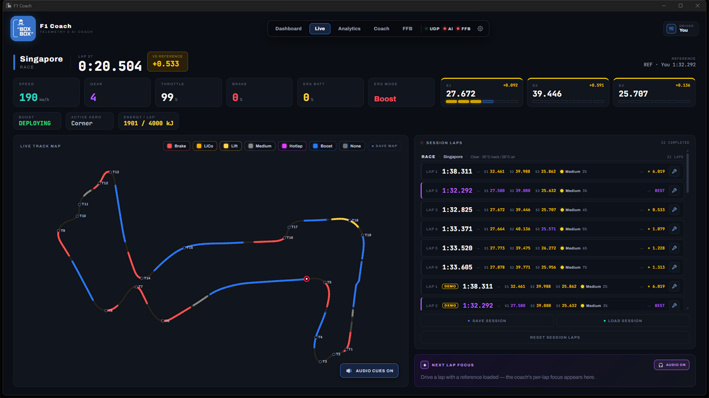
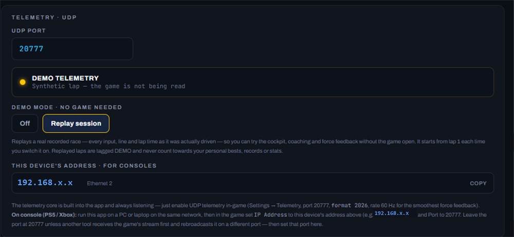
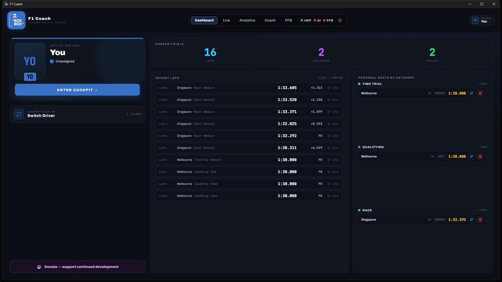
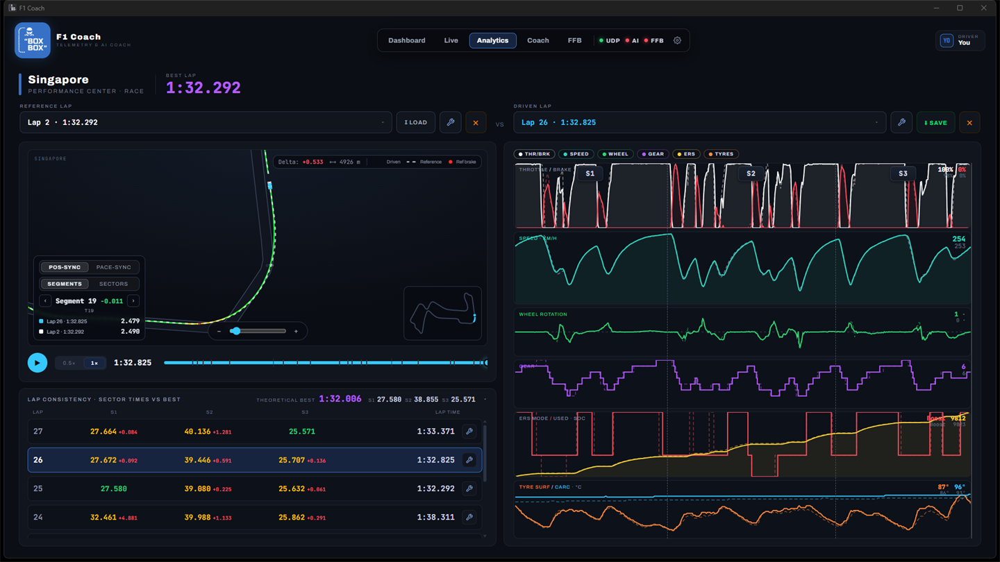
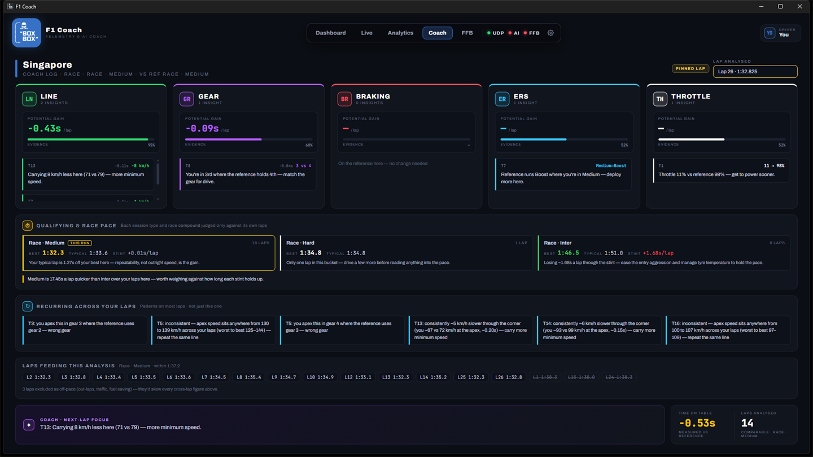
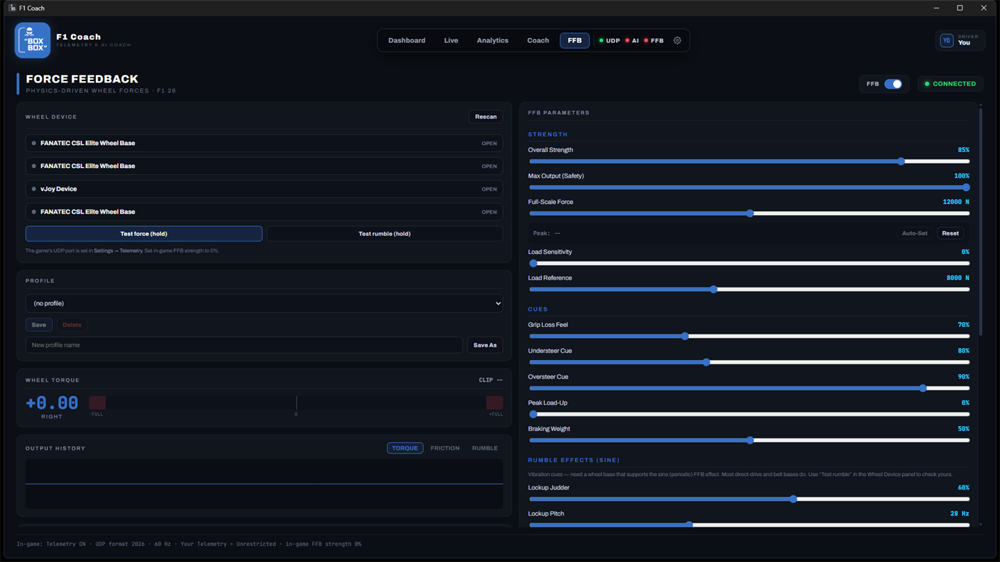

# F1 Coach

**An AI race engineer for EA SPORTS F1™ 25/26.** F1 Coach reads the game's live UDP
telemetry, compares your driving against reference traces, drives your force-feedback
wheel, and coaches you over "team radio" — real-time braking/ERS calls in the corner, and
an LLM race engineer that debriefs you between laps.

> Windows desktop app built with **Tauri 2** (Rust shell) + **React 18 / Vite** frontend.
> Telemetry parsing and force feedback run in-process in the Rust core. Small installer,
> low RAM — designed to run alongside the game.



<sub>Screenshots are taken in demo mode — the app replaying a real recorded Singapore race —
on the default livery. Team skins restyle the whole app.</sub>

---

## What it does

- **Live telemetry dashboard** — speed, throttle/brake, gear, ERS mode, tyre & brake temps,
  DRS, fuel, and per-sector / mini-sector timing, streamed live from the game at up to
  30 Hz.
- **Reference-trace comparison** — pick a reference lap (a hot lap you drove, or a `.json`
  trace file) and see where you're losing time, corner by corner, sector by sector.
- **Two-layer coaching** (see [Architecture](#architecture)):
  - A **real-time rule engine** makes in-corner calls (brake point, lift-and-coast, ERS
    deployment) the instant they're needed.
  - An **LLM race engineer** acts as a between-lap analyst — a grounded debrief of the lap
    you just completed, plus a next-lap focus.
- **Force feedback** — a Rust FFB engine drives your wheel from the raw telemetry via SDL2,
  with its own live monitor and a full set of tunable parameters.
- **Voice out** — local **Kokoro** text-to-speech (ONNX, self-hosted, runs offline) so the
  calls come at you as radio, hands on the wheel. There is no voice input.
- **Speech arbiter** so the engine and the AI never talk over each other — urgent real-time
  calls preempt; stale AI tips are dropped.
- **Mini-sector derivation** — the F1 UDP stream only broadcasts 3 real sectors, so the app
  derives 18 mini-sectors locally from the real sector boundaries and colours them with the
  game's own faster/slower rule.

---

## Setup guide

### 1. Install

Grab the latest `F1 Coach_<version>_x64-setup.exe` from the
[Releases](https://github.com/therealbeno82/BoxBoxF1Coach/releases) page and run it. It's a
normal Windows installer — no runtime to install separately (WebView2 ships with current
Windows). To build it yourself instead, see
[Building from source](#getting-started-development).

### 2. Turn on UDP telemetry in the game

In **F1 25/26**: *Settings → Telemetry Settings*

| Setting          | Value                                              |
|------------------|----------------------------------------------------|
| UDP Telemetry    | **On**                                             |
| UDP Format       | **2026** (the app parses the 2026 packet format only) |
| IP Address       | `127.0.0.1` on PC — or your PC's LAN IP on console (see below) |
| Port             | `20777`                                            |
| Send Rate        | **60 Hz** (smoothest force feedback)               |

The app is always listening — there's no "connect" button. The **UDP** pill in the header
goes green when packets arrive.

### 3. Sign a driver

Open **⚙ Settings → Driver**. Add a name, number, team and livery colour. Everything the
app records — laps, personal bests, preferences, the coach's history — is stored per
driver, and the team livery reskins the whole UI.

### 4. Connect the coach (optional)

In **⚙ Settings → AI Coach**, paste an **OpenRouter API key** and pick a model (default
`anthropic/claude-3.5-haiku`; *Load models* lists everything OpenRouter offers). Without a
key the real-time rule engine still runs in full — you just lose the between-lap debrief.

> The key is stored in plain text in the app's local storage. It never leaves your machine
> except in requests to OpenRouter.

### 5. Set up your wheel (optional)

Open the **FFB** tab, pick your wheel under *Wheel Device*, and choose a profile. The live
monitor shows wheel torque, clipping and the grip gauges so you can tune with feedback.

### 6. Try it without the game

**⚙ Settings → Demo Mode → Replay session** replays a real recorded race — a 25-lap
Singapore run that goes from mediums to intermediates when the rain arrives — through the
whole pipeline: cockpit, coaching, voice and FFB, with no game running. Every input, racing
line and lap time is the one that was actually driven, so the traces, the track map and the
coach's debrief all show real driving. It restarts from lap 1 each time you switch it on.
Replayed laps are tagged **DEMO** in the lap log and never count: they can't take a personal
best, set a sector record, or appear in your stats, and the coach never measures a lap you
drove against one of them.

---

## Playing on console (PS5 / Xbox)

Console telemetry works. The game will happily broadcast to another device on your network,
and the app listens on all interfaces, so:

1. Run F1 Coach on a **PC or laptop on the same network** as the console.
2. In **⚙ Settings → Telemetry · UDP**, find *This Device's Address* — click an address to
   copy it.
3. In the game's telemetry settings on the console, set **IP Address** to that address and
   **Port** to `20777` (format 2026, 60 Hz as above).



**The known limitation:** the coach's audio comes out of the PC running the app, not the
console. So the radio calls play through whatever speakers/headset that PC is using, while
you're wearing a headset plugged into the console — which in practice means you either
don't hear the coach, or you have to run one earbud from each device.

There's no clean fix in the app today. Workarounds that people use, roughly in order of how
well they work:

- Run the PC's audio into a **headset you can hear alongside the console** (a second earbud,
  or an open-back headset with the console on speakers).
- Feed the PC's output into a **mixer or an audio interface** together with the console's,
  and drive one headset from the mix.
- Use a **Bluetooth/USB headset paired to the PC** and take game audio from the TV.

Solving this properly — streaming the coach's audio to the console side, or to a phone/app
you can pair with your headset — is an open problem and a wanted feature. If you have ideas
or a working rig, open an issue.

---

## Using the app

The header switcher has five screens, with **UDP / AI / FFB** status pills and the driver
chip alongside.

### Dashboard
Your session at a glance: personal bests per circuit and session type, lap counts, recent
form and trends across everything the active driver has ever driven.



### Live
The cockpit view while you're on track — speed, gear, revs, ERS, tyre and brake temps, fuel,
DRS, delta and the 18 mini-sectors colouring live as you cross them, plus the track map with
numbered corners. This is where the rule engine's in-corner calls fire. The map colours each
zone by the call it carries — brake, lift-and-coast, lift, boost — and the sector strip
shows where the lap is going against the reference. (Screenshot at the top of this page.)

### Analytics
Post-session analysis in one view. Pick a **Reference** and a **Driven Lap** from the two
selectors and the traces overlay — speed, throttle, brake, gear, steering — with hover
readouts and a per-corner time-loss breakdown.



- Any lap you've driven can be the reference; **⬆ Load** imports `.json` trace files
  (multiple at once) and **⬇ Save** exports the lap on screen so you can share it or keep it
  as a benchmark.
- The reference only counts if it's **comparable** — same circuit, same wet/dry, same
  race-vs-push intent, same compound. If it isn't, the app tells you and withholds both the
  insights *and* the corner calls, since both are derived from that reference.

### Coach
The debrief. A structured read of one completed lap per telemetry channel, a
qualifying/race-pace assessment, and a next-lap focus. It follows your newest lap by
default; the **Lap analysed** selector pins it to any lap of the session. The deterministic
analysis is free and instant; the LLM debrief costs an API call and sits behind a button.



### FFB
Wheel setup and live monitoring — device and profile pickers, wheel torque and clip meters,
an output scope, grip gauges, and the full parameter set (strength, ceiling, full-scale
force, load sensitivity and the rest) with hover hints explaining each one.



### ⚙ Settings
UDP port and device addresses, demo mode, units (speed, tyre temps), the coach's API key and
model, voice engine and voice, team skins, the driver roster, and profile backup/import.

---

## Architecture

```
 ┌────────────────────┐   UDP :20777    ┌─────────────────────┐  Tauri events  ┌──────────────────────┐
 │  F1 25/26 (game)   │ ──────────────▶ │  Rust telemetry core│ ─────────────▶ │  React UI (WebView)  │
 │  UDP telemetry     │   format 2026   │  (in-process)       │  ~30 Hz, only  │  in the Tauri shell  │
 └────────────────────┘                 └──────────┬──────────┘   on change    └──────────┬───────────┘
                                                   │ lock-free snapshot                   │
                                                   ▼ (full rate)              ┌───────────┴────────────────────┐
                                        ┌─────────────────────┐               │  Coaching                      │
                                        │  FFB engine (Rust)  │               │  • Rule engine (real-time)     │
                                        │  → wheel via SDL2   │               │  • LLM (between-lap debrief)   │
                                        └─────────────────────┘               │  • Kokoro TTS (voice out)      │
                                                                              └────────────────────────────────┘
```

**Why an in-process core?** The webview can't read raw UDP, so the Rust shell owns a single
UDP listener that parses the game's packets and publishes a lock-free snapshot. Two consumers
read it: the force-feedback engine at full rate (UI cadence never adds FFB latency), and an
emitter thread that forwards changes to the UI as Tauri events at ~30 Hz. No sidecar process,
no WebSocket — it starts and stops with the app.

**Why two coaching layers?** An LLM is too slow to make on-the-mark corner calls, so all
real-time calls live in a deterministic rule engine that always runs (and is what you get
when no AI is connected). The LLM only speaks in quiet windows — at the start/finish line,
with a lap debrief. A priority-based speech arbiter (`urgent > normal > low`) keeps the two
from overlapping.

### LLM provider
The coach speaks through **OpenRouter** (cloud, low-latency models suit short radio
calls — default `anthropic/claude-3.5-haiku`, switchable to any OpenRouter model from
Settings). The prompt layer includes genuine guardrails — grounding (the model may only
cite numbers present in the lap evidence), location language (corners, not metres),
scope/anti-jailbreak, and untrusted-data wrapping.

---

## Tech stack

| Layer          | Tech                                                                 |
|----------------|----------------------------------------------------------------------|
| Native shell   | Tauri 2 (Rust), `tauri-plugin-opener`, `tauri-plugin-log`            |
| Frontend       | React 18, Vite 6                                                     |
| Telemetry      | In-process Rust UDP parser (2026 packet format), lock-free `arc-swap` snapshot |
| Force feedback | Rust FFB engine → wheel via SDL2 haptics (statically linked)         |
| Speech         | `kokoro-js` (TTS) on ONNX runtime, self-hosted wasm                  |
| LLM            | OpenRouter                                                           |
| Packaging      | Tauri NSIS installer                                                 |

---

## Project layout

```
src/                     React app
  BoxBoxApp.jsx          Root: telemetry/lap/coaching state, lap recorder, speech pipeline
  components/screens/    Dashboard, Live, Analytics, Coach Log, FFB, Settings
  components/            Shell (nav chrome), telemetry studio, driving lines, modals
  lib/coach/             Prompts, schema, guardrails, lap analysis, reference matching, provider
  lib/                   Track data & geometry, corner anchors, tyres, formatting, Kokoro TTS, UI tokens/skins
  hooks/                 useTelemetry, useTauriEvents, useFfbEngine, useLlmHealth, useTrackCorners, useUpdateCheck
scripts/copy-ort.mjs     Copies ONNX runtime wasm into /public/ort (CSP: served same-origin, not via CDN)
src-tauri/src/telemetry/ Rust core: UDP listener + 2026-format packet parsing, shared snapshot
src-tauri/src/ffb/       Rust FFB engine: reads the snapshot, drives the wheel via SDL2
src-tauri/src/lib.rs     Tauri commands + the ~30 Hz change-only event emitter; window + CSP config
public/ort/              Self-hosted ONNX runtime wasm
public/tracks/           Committed circuit geometry (all 25 circuits)
```

---

## Prerequisites (building from source)

- **Windows 10/11**.
- **Node.js 22+** and npm.
- **Rust** (stable, MSVC toolchain) + **Visual Studio Build Tools** (Desktop C++) and
  **CMake** — SDL2 is built from source and statically linked, so the first compile is slow.
- **WebView2** runtime (preinstalled on current Windows).

---

## Getting started (development)

```bash
# 1. Install dependencies (also copies the ONNX runtime into /public/ort)
npm install
```

```bash
# 2. Fetch the local Kokoro TTS weights (~97 MB, one-time — not in git)
node scripts/fetch-kokoro-model.mjs
```

```bash
# 3. Run the full native app (the Rust core owns the UDP listener)
npm run tauri:dev
```

> No game running? Use the **Demo Mode** toggle in Settings and the core replays a real
> recorded race (`src-tauri/demo/session.json`, compiled into the exe) so you can work on the
> UI without the game. Swap in a different session with
> `node scripts/make-demo-session.mjs "<session-export.json>"`, exported from the app's own
> lap log. `npm run dev` alone previews the web UI in a browser with no native core — so no
> telemetry and no FFB.

There are no tests and no linter configured; verify changes by running the app.

---

## Building the installer

```bash
npm run tauri:build
```

Outputs:
- Raw binary: `src-tauri/target/release/boxbox.exe`
- Installer:  `src-tauri/target/release/bundle/nsis/F1 Coach_<version>_x64-setup.exe`

---

## Configuration reference

| Setting            | Default                       | Where                                        |
|--------------------|-------------------------------|----------------------------------------------|
| UDP port           | `20777`                       | Settings → Telemetry · UDP (rebinds live)    |
| UDP format         | `2026`                        | in-game telemetry settings                   |
| UI event rate      | ~30 Hz, change-only           | emitter thread in `src-tauri/src/lib.rs`     |
| OpenRouter model   | `anthropic/claude-3.5-haiku`  | Settings → AI Coach / `src/lib/coach/config.js` |

---

## Offline behaviour

The app is built to work with no network — telemetry is UDP and the TTS weights are
bundled, so a race weekend never needs the internet. Only three network calls exist, all
optional and all failing soft: OpenRouter (coaching), the GitHub release check, and a
Kokoro CDN fallback that only applies in dev.

---

## Security notes

A full review lives in [CODE_REVIEW.md](CODE_REVIEW.md). Highlights:

- The Tauri attack surface is minimal — capabilities grant only `core:default` and
  `opener:default`, and the CSP is tightly scoped (`object-src 'none'`, `frame-src 'none'`,
  `base-uri 'self'`).
- The LLM layer has real prompt-injection defenses (grounding, scope rule, `<< >>` data
  wrapping, output sanitization).
- **Your OpenRouter API key is stored in plaintext** in the app's local data
  (`localStorage`). It never leaves your machine except in requests to OpenRouter, but a
  local process or anyone with disk access could read it. Treat it accordingly.
- The UDP listener binds all interfaces so console players can point a second device at the
  PC's LAN IP — it only ever *receives* game telemetry; nothing is served on the network.

---

## Status

v1.0.0 — first tagged release. Live telemetry, reference comparison, the two-layer coach,
force feedback and voice out all work. See [CODE_REVIEW.md](CODE_REVIEW.md) for known
hardening items and the issue tracker for the roadmap.

---

## Acknowledgements

- Circuit geometry from [bacinger/f1-circuits](https://github.com/bacinger/f1-circuits)
- On-device speech via [Kokoro](https://github.com/hexgrad/kokoro) on
  [ONNX Runtime](https://onnxruntime.ai/)
- Cloud LLM routing via [OpenRouter](https://openrouter.ai)

*Not affiliated with or endorsed by EA, Codemasters, or Formula 1. "F1" and related marks
belong to their respective owners. For personal, non-commercial use.*
